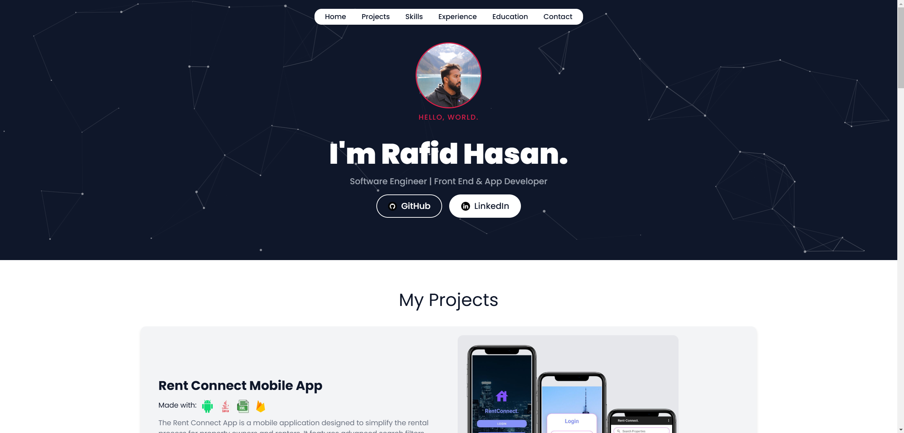
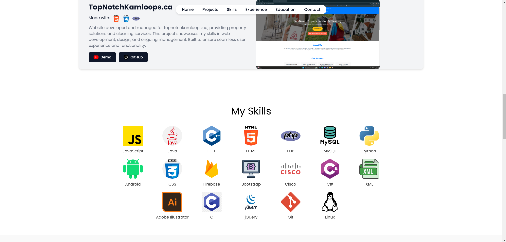

# Personal Portfolio Website

Welcome to my personal portfolio website! 🚀 This website showcases my projects, skills, experience, and education as a Software Engineer specializing in Front-End and App Development.

---

## 🌐 Website Link

Check out the live version of my portfolio here: [rafidhasan.com](https://rafidhasan.com)

---

## 📖 About the Website

This portfolio was created to:
- Display my professional journey, including my skills, projects, and experience.
- Serve as a central hub for my GitHub repositories and LinkedIn profile.
- Provide potential collaborators and employers with an overview of my expertise and achievements.

---

## ✨ Features

- **Interactive Design**: A modern and responsive design with animations and dynamic visuals.
- **Projects Section**: Highlights key projects with details and technologies used.
- **Skills Overview**: A comprehensive list of technical skills.
- **Experience & Education**: Provides an overview of my professional background and academic achievements.
- **Contact Section**: Includes links to my GitHub, LinkedIn, and an email contact form.
- **Fully Responsive**: Optimized for desktop, tablet, and mobile devices.

---

## 🔧 Technologies Used

- **Frontend**:
  - HTML5
  - CSS3
  - JavaScript
- **Backend**:
  - None (Static website)
- **Hosting**:
  - Hosted on a custom domain: [rafidhasan.com](https://rafidhasan.com)

---

## 🖼️ Screenshots

### Home Page

### Projects Section

---

## 📧 Contact

If you'd like to get in touch or learn more, feel free to reach out:

- **Email**: rafidhasan202@gmail.com
- **LinkedIn**: www.linkedin.com/in/-rafidhasan
- **GitHub**: https://github.com/Raf1dhasan

---

## 🌟 What I Learned

- Improved my front-end development skills with responsive web design techniques.
- Enhanced my ability to create clean and interactive user interfaces.
- Learned how to deploy a static website to a custom domain.

---

## 🔮 Future Enhancements

- Add a blog section to share knowledge and tutorials.
- Integrate a light/dark mode toggle for enhanced user experience.
- Add more animations and interactive elements to the website.

---

